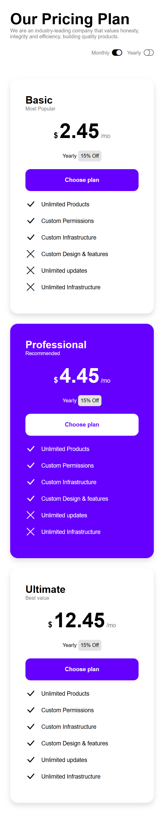

# HTML/CSS Pricing Plan

> Tip: Code decisions are explained in the [Implementation Notes](#implementation-notes)

Static responsive pricing plan page for a web development course exercise.

## Live Demo

[**View on GitHub Pages &nbsp; 🌐**](https://emanuelefavero.github.io/htmlcss-pricing-plan/)

## Exercise Goal

Match the provided reference layouts using HTML and CSS, with a focus on responsive card layout behavior.

### Reference layouts

#### Mobile

#### Tablet

#### Desktop

## Scope

- Use HTML and CSS
- No JavaScript
- Use a generic sans-serif font
- Prefers `flex` shorthand with `calc()` for cards layout, but CSS grid is also acceptable when it reduces code complexity and achieves the same result
- Prefers only setting a `width` or `max-width` for the cards container or main container, and work with `flex` or `grid` to achieve the desired layout, but media queries are acceptable when necessary
- Mobile layout: pricing cards stacked vertically
- Tablet layout: pricing cards arranged in two columns
- Desktop layout: pricing cards arranged in three columns when space allows
- Bonus: on tablet, make the third card full width
- Bonus: when a card is full width, arrange its feature list in two columns
- Bonus: on mobile, show the professional card first

## Implementation Notes

- Made sure the max content width is `900px` and calculated horizontal padding + content width for the main container.
- Chosen `640px` as the breakpoint for mobile/tablet and `900px` for tablet/desktop, as these are common and worked well with the layout.
- Considered creating switch toggles with html/css for interactivity, but decided to use Bootstrap icons for simplicity, as this exercise focuses on layout and responsiveness rather than interactivity
- Used container queries to switch the features list to two columns when the card has enough width, as this allows for a more modular and responsive design without relying on media queries that target specific breakpoints
- Used `flex` with `calc()` and css custom properties to create the responsive card layout, as this allows for a more fluid and adaptable design, no matter the amount of cards.
- Centered the switches with `align-self: center` on mobile, and used media queries to reset the behavior on larger screens.
- Ordered the second card (Professional) first on mobile using the `order` property and media queries.
- Used css custom properties for colors and other values
- Used component classes and css nesting to scope styles to specific components and avoid unintended side effects.

&nbsp;

---

&nbsp;

[**Go To Top &nbsp; ⬆️**](#htmlcss-pricing-plan)
